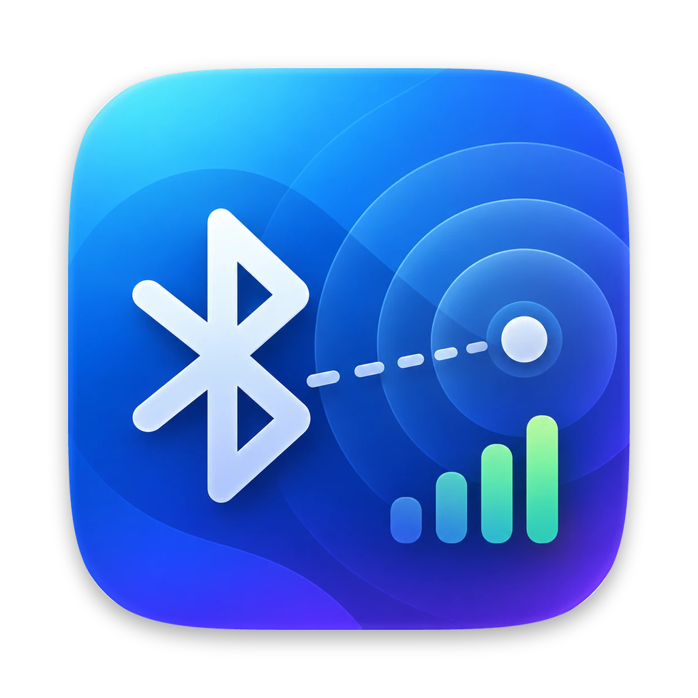

<p align="center"></p>

# BLE Proximity

Een kleine native macOS-app (SwiftUI + CoreBluetooth) die Bluetooth Low Energy-apparaten in de buurt scant en zo nauwkeurig mogelijk de afstand schat op basis van de signaalsterkte (RSSI).

## Functies

- **Live scan van alle BLE-advertisements**, met elk pakket (duplicaten) voor de hoogste meetfrequentie.
- **Herkenning van fabrikant en type:** Bluetooth SIG company-ID's (Apple, Microsoft, Samsung, Google …), Apple Continuity-berichten (AirPods-model, Find My/AirTag, Nearby Info, AirPlay, Handoff, iBeacon) en bekende service-UUID's.
- **Kalman-filter op RSSI** waarvan de reactiesnelheid instelbaar is. Het filter houdt rekening met de tijd tussen pakketten.
- **Afstandsschatting met het log-distance-model** `d = 10^((RSSI@1m − RSSI) / 10n)`, met een marge van ±1σ.
- **Kalibratie op 1 m per apparaat:** 5 s meten met een getrimd gemiddelde. Het resultaat wordt bewaard.
- **Live grafiek** met ruwe pakketten en de gefilterde lijn, of met de afstand.
- **Meetstatistiek:** pakketten per seconde, gemiddeld interval, σ, min/max.
- **CSV-opname** van elk pakket (timestamp, RSSI ruw/gefilterd, afstand).
- **Schuifjes:** meetinterval (50–2000 ms), reactiesnelheid, padverliesexponent *n* en grafiekvenster.
- **Zoeken, sorteren en filteren** op minimumsignaal, herkende apparaten en vastgezette apparaten.

## Downloaden

Een ondertekende en genotariseerde versie staat onder [Releases](../../releases). Vereist macOS 14 of nieuwer. Bij de eerste start vraagt macOS om toestemming voor Bluetooth.

## Zelf bouwen

```bash
./build.sh --run        # lokale build, ad-hoc ondertekend
./release.sh 1.0        # universele build + Developer ID + notarisatie
```

## Over nauwkeurigheid

- Een Mac kan een apparaat niet sneller laten uitzenden. Het advertisement-interval bepaalt het apparaat zelf (meestal 20 ms tot 1 s).
- RSSI schommelt binnen al snel 3–6 dB door reflecties, lichaamsdemping en antenne-oriëntatie. Reken op ±1–2 m tot ongeveer 3 m, en daarbuiten fors meer.
- Kalibreren op 1 m en een passende *n* kiezen geven de grootste winst: 2,0 bij vrije zichtlijn, 2,5–3,5 binnen.
- Apple-apparaten wisselen elke ~15 minuten van Bluetooth-adres en verschijnen dan als nieuw apparaat.
